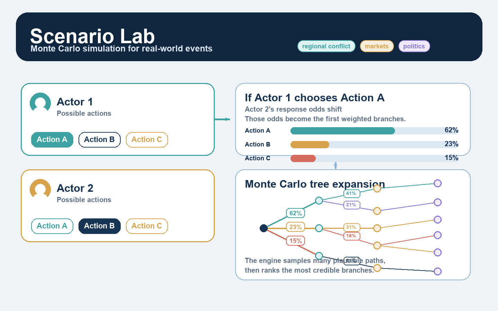
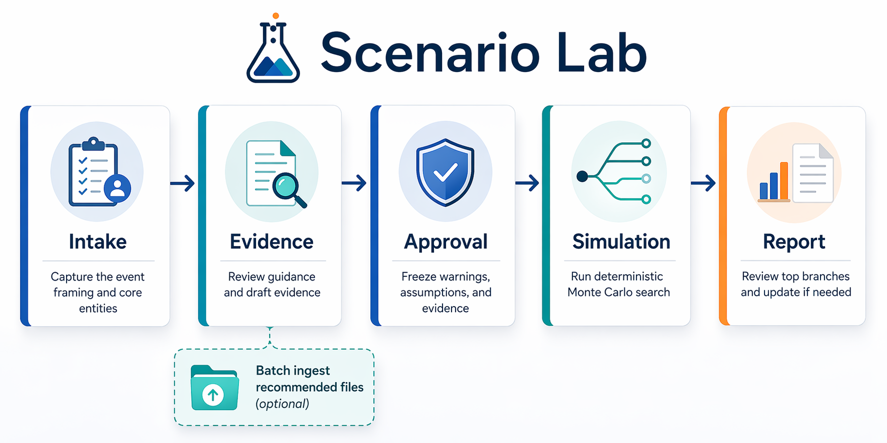

# Scenario Lab

🌐 Languages: [English](README.md) | [中文](README.zh-CN.md) | [Español](README.es.md) | [Français](README.fr.md) | [한국어](README.ko.md) | [日本語](README.ja.md)

> 실험적 프리뷰: Codex 또는 Claude로 로컬에서 실행할 수 있는 실제 사건 몬테카를로 시뮬레이션 도구입니다.

언어: 한국어

이 번역은 읽기 편의를 위해 제공됩니다. English README is canonical 이며, 제품 범위, 라이선스 조건, 면책 고지, 릴리스 세부 사항은 영어 README를 기준으로 합니다.

Scenario Lab은 지역 분쟁, 시장 스트레스, 정치적 협상, 기업 의사결정 같은 실제 사건을 위한 몬테카를로 시뮬레이션 엔진입니다. 연구용 실험 도구이며 예측 제품이 아니고 금융 조언이 아닙니다.

버전: `v0.1.0` 공개 프리뷰. 기여자: [CONTRIBUTORS.md](CONTRIBUTORS.md).



## 무엇인가

Scenario Lab은 전개 중인 상황을 구조화된 시뮬레이션 실행으로 바꿉니다. 사용자는 주요 행위자, 현재 전개, 승인할 증거를 제공합니다. 엔진은 몬테카를로 트리 탐색으로 여러 갈래의 미래를 탐색하고 찾은 분기를 순위화합니다.

작동 방식:

- 도메인 팩은 국가 간 위기, 시장 충격, 기업 의사결정 같은 사건 유형의 행위자, 단계, 행동 공간을 정의합니다.
- 승인된 증거 패킷과 사례 구성은 행위자 행동 프로필과 도메인 전용 필드를 포함한 믿음 상태로 컴파일됩니다.
- 시뮬레이션 엔진은 해당 상태에서 `mcts`를 실행하고, 행동을 제안하며, 상태 전이를 샘플링하고, 분기에 점수를 매깁니다.
- 보고서는 탐색된 분기를 읽기 쉬운 결과, 시나리오 묶음, 보정된 신뢰도 라벨로 변환합니다.

같은 실행 환경은 지역 분쟁, 시장 스트레스, 정치 협상, 기업 대응 사례에 사용할 수 있습니다. 각 도메인 팩이 서로 다른 규칙과 상태 필드를 담고 있기 때문입니다.

## 빠른 시작

전체 첫 사용 흐름은 [docs/quickstart.md](docs/quickstart.md)에 있습니다. 최소 로컬 설치:

```bash
git clone git@github.com:YSLAB-ai/scenario-lab.git
cd scenario-lab
PYTHON=/path/to/python3.12
"$PYTHON" -m venv packages/core/.venv
source packages/core/.venv/bin/activate
pip install -e 'packages/core[dev]'
scenario-lab demo-run --root .forecast
```

`demo-run complete`가 표시되고 `.forecast/runs/demo-run` 아래에 결과물이 생성됩니다.

자연어 시작 예시:

```bash
scenario-lab scenario --root .forecast "/scenario how would a U.S.-Iran conflict at the Strait of Hormuz develop over the next 30 days"
```

Scenario Lab은 다음 환경에서 사용할 수 있습니다.

- `Codex`: [docs/install-codex.md](docs/install-codex.md)
- `Claude Code`: [docs/install-claude-code.md](docs/install-claude-code.md)

Claude Code 프로젝트 명령:

```text
/scenario how would a U.S.-Iran conflict at the Strait of Hormuz develop over the next 30 days
```

## 증거 코퍼스

증거 초안은 기본적으로 로컬 SQLite 데이터베이스 `.forecast/corpus.db`를 사용합니다. 아직 코퍼스가 없다면 관련 증거 파일을 `.forecast/evidence-candidates/`에 저장한 뒤 실행합니다.

```bash
scenario-lab ingest-directory --root .forecast --path .forecast/evidence-candidates --tag domain=interstate-crisis
scenario-lab draft-evidence-packet --root .forecast --run-id <run-id> --revision-id r1
```

어댑터 런타임으로 추천 파일을 일괄 수집할 수도 있습니다.

```bash
scenario-lab run-adapter-action --root .forecast --candidate-path .forecast/evidence-candidates --run-id <run-id> --revision-id r1 --action batch-ingest-recommended
scenario-lab run-adapter-action --root .forecast --run-id <run-id> --revision-id r1 --action draft-evidence-packet
```

별도 증거 데이터베이스가 필요할 때만 `--corpus-db <path>`를 사용하세요.

## 작업 흐름과 데모

일반적인 실행은 다음 단계를 거칩니다.



1. `intake`: 문제를 이해하고 주요 행위자와 시간 범위를 정합니다.
2. `evidence`: 중요한 제3자, 부족한 증거, 가져올 수 있는 자료를 검토합니다.
3. `approval`: 탐색 전에 설정, 가정, 증거를 고정합니다.
4. `simulation`: 결정적 몬테카를로 트리 탐색으로 가능한 경로를 탐색합니다.
5. `report`: 주요 결과와 분기 설명을 보여주고 상황 업데이트를 이어갈 수 있게 합니다.

검증된 `U.S.-Iran` 예시는 [docs/demo-us-iran.md](docs/demo-us-iran.md)에 있습니다. 이 실행은 `10000`회 반복을 사용했고 `133`개 노드와 `111`회 전치 적중을 생성했습니다. 현재 국가 간 위기 도메인 팩은 제한된 위기 경로를 모델링하며 전면전을 명시적 최종 결과로 모델링하지 않습니다.

## 효과적인 이유

Scenario Lab은 모든 분기를 동일하게 그럴듯하다고 보지 않습니다. 분기 탐색은 도메인 규칙, 행위자 행동 프로필, 승인된 증거에 의해 형성됩니다.

- 행동은 도메인 팩으로 제한됩니다.
- 증거는 행위자 프로필과 도메인 필드에 영향을 줍니다.
- 이후의 부정적 결과는 순위에서 불리하게 작용합니다.
- 더 강한 증거와 도메인 지식은 보통 분기 구분을 개선합니다.

AI 에이전트가 얇은 도메인 팩을 개선하게 하려면 [docs/domain-pack-enrichment.md](docs/domain-pack-enrichment.md)를 따르게 하세요.

## 현재 한계

[docs/limitations.md](docs/limitations.md)를 확인하세요.

- 출력 품질은 승인된 증거 패킷에 크게 의존합니다.
- 출력 품질은 도메인 팩의 깊이와 품질에 크게 의존합니다.
- 역사적 재실행 범위, 증거 품질, 도메인 지식은 커뮤니티 기여로 개선됩니다.
- OCR 기반 PDF 가져오기는 현재 공개 프리뷰에서 의도적으로 연기되어 있습니다.

## 라이선스와 면책

Scenario Lab은 [PolyForm Noncommercial License 1.0.0](LICENSE)로 제공됩니다. 공개 저장소는 비상업적 사용을 위한 것이며 상업적 배포나 재판매에는 사용할 수 없습니다.

Required Notice: Copyright Heuristic Search Group LLC

이 저장소는 실험, 교육, 연구 용도입니다. 예측 제품이 아니며 미래 사건을 보장하지 않고 전문적 판단, 투자 판단, 운영 의사결정을 대체하지 않습니다. 금융 조언이 아닙니다.

소프트웨어는 `as is`로 제공되며 보증이 없습니다. 법이 허용하는 범위에서 Heuristic Search Group LLC는 금융 손실, 거래 손실, 운영 손실 또는 기타 손해에 대해 책임지지 않습니다. [LICENSE](LICENSE), [NOTICE](NOTICE), [docs/limitations.md](docs/limitations.md)를 확인하세요.

## 기타 링크

- 영어 기준 README: [README.md](README.md)
- 빠른 시작: [docs/quickstart.md](docs/quickstart.md)
- 작업 흐름: [docs/natural-language-workflow.md](docs/natural-language-workflow.md)
- 데모: [docs/demo-us-iran.md](docs/demo-us-iran.md)
- 기여자: [CONTRIBUTORS.md](CONTRIBUTORS.md)
- 릴리스 노트: [docs/release-notes/public-preview.md](docs/release-notes/public-preview.md)
